# Project 1 Planning: The Unofficial Guide

> Write this document before you write any pipeline code.
> Your spec and architecture diagram are what you'll use to direct AI tools (Claude, Copilot, etc.) to generate your implementation — the more specific they are, the more useful the generated code will be.
> Update the Retrieval Approach and Chunking Strategy sections if you change your approach during implementation.
> Update this file before starting any stretch features.

---

## Domain

<!-- What domain did you choose? Why is this knowledge valuable and hard to find through official channels? -->
RowdyHacks Knowledge Base: Information about the last hackathon by the University of Texas at San Antonio and some advice and experiences from the past hackathon eparticipants

A retrieval-augmented generation (RAG) system designed to make information about RowdyHacks, the hackathon hosted by the University of Texas at San Antonio, more accessible to future participants. The system will compile advice, experiences, project insights, and lessons learned from previous attendees to help students better prepare for the event.
This knowledge is valuable because official hackathon websites typically focus on schedules, rules, and registration details rather than practical advice from participants. Important information about forming teams, selecting project ideas, managing time effectively, choosing technologies, and avoiding common mistakes is often scattered across Devpost project pages, Reddit discussions, participant reflections, and other informal sources. By consolidating these perspectives into a searchable knowledge base, future RowdyHacks participants can receive grounded answers supported by real experiences from past hackers.
---

## Documents

<!-- List your specific sources: URLs, subreddit names, forum threads, or file descriptions.
     Aim for at least 10 sources that together cover different subtopics or perspectives within your domain. -->

| # | Source | Description | URL or location |
|---|--------|-------------|-----------------|
| 1 | RowdyHakcs website | the lastest hackathon at the University of Texas at San Antonio| https://rowdyhacks.org|
| 2 | Survival Guide| Information that help the student prepare and serve for the hackathone| https://acmutsa.notion.site/RHXI-Survival-Guide-186c7f3b374281c2a72edb1df6e4daa6|
| 3 | RowdyHacks Instagram account| Information about the past couple of RowdHacks| https://www.instagram.com/rowdyhacks/|
| 4 | Reddit| Tips for hackathons| https://www.reddit.com/r/csMajors/comments/17irlcq/any_tips_for_hackathon/|
| 5 | Quora| Tips for preparing for hackathons| https://www.quora.com/How-do-you-prepare-for-and-win-hackathons|
| 6 | Medium article| Tips and Strategy| https://medium.com/@allankong/ive-won-thousands-in-hackathons-here-are-my-tips-and-strategies-72267f9f3974|
| 7 | Devpost| Information about the past projects in Hackthons and the upcoming Hackathons| https://devpost.com|
| 8 | Reddit| Hackathone ideas| https://www.reddit.com/r/AI_Agents/comments/1kh559v/megathread_post_your_hackathon_ideas_here/|
| 9 | OpenAI Developer Community| Hackathon Ideas| https://community.openai.com/t/unofficial-weekend-project-hackathon-ideas/1150059|
| 10 | Devpost| Last RowdyHacks information page| https://rowdyhacks-xi.devpost.com/?ref_feature=challenge&ref_medium=discover|

---

## Chunking Strategy

<!-- How will you split documents into chunks?
     State your chunk size (in tokens or characters), overlap size, and explain why those
     numbers fit the structure of your documents.
     A review-heavy corpus warrants different chunking than a long FAQ. -->

**Chunk size:**
approximately 300 words per chuck

**Overlap:** 50 words

**Reasoning:**
The document collection contains a mixture of short advice posts, participant reflections, Devpost project descriptions, and official RowdyHacks information. A chunk size of around 300 words is large enough to preserve context and capture complete ideas, such as explanations of team formation strategies or lessons learned from a project, while remaining small enough for precise retrieval. An overlap of 50 words helps ensure that important information spanning the boundary between two chunks is not lost during retrieval. This balance should improve the likelihood that retrieved chunks are both self-contained and relevant to user queries.
---

## Retrieval Approach

<!-- Which embedding model are you using (e.g., all-MiniLM-L6-v2 via sentence-transformers)?
     How many chunks will you retrieve per query (top-k)?
     If you were deploying this for real users and cost wasn't a constraint, what tradeoffs
     would you weigh in choosing a different embedding model — context length, multilingual
     support, accuracy on domain-specific text, latency? -->

**Embedding model:**
all-MiniLM-L6-v2 from the sentence-transformers library.
**Top-k:**
5 retrieved chunks per query
**Production tradeoff reflection:**
The all-MiniLM-L6-v2 model was chosen because it runs locally, is free to use, and provides strong semantic search performance for a small-scale educational project. In a production environment, factors such as retrieval accuracy, multilingual support, latency, and cost would influence the choice of embedding model. More powerful models may provide better performance on domain-specific queries and longer contexts, but they often require greater computational resources or paid API access. Selecting the appropriate model would involve balancing quality, scalability, and operational costs.
---

## Evaluation Plan

<!-- List your 5 test questions with their expected correct answers.
     Questions should be specific enough that you can judge whether the system's response
     is right or wrong. "What are good dining halls?" is too vague.
     "What do students say about wait times at [dining hall name] during lunch?" is testable. -->

| # | Question | Expected answer |
|---|----------|-----------------|
| 1 | How should beginners prepare before attending RowdyHacks?| Tips to prepare for the hackathon|
| 2 | How should beginners prepare before attending RowdyHacks?| Challenge in Hackathon that he past participant experienced|
| 3 | What advice do experienced participants give first-time hackers?| Advice for beginners|
| 4 | What makes a project stand out to judges?| The standout quality that the judges are looking for the projects|
| 5 | How do participants recommend finding teammates?| Tips to find teammates|

---

## Anticipated Challenges

<!-- What could go wrong? Name at least two specific risks with reasoning.
     Consider: noisy or inconsistent documents, missing source attribution, off-topic
     retrieval, chunks that split key information across boundaries. -->

1. Off-topic retrival

2. inconsistent documents

---

## Architecture

<!-- Draw a diagram of your pipeline showing the five stages:
     Document Ingestion → Chunking → Embedding + Vector Store → Retrieval → Generation
     Label each stage with the tool or library you're using.
     You can use ASCII art, a Mermaid diagram, or embed a sketch as an image.
     You'll use this diagram as context when prompting AI tools to implement each stage. -->

---

## AI Tool Plan

<!-- For each part of the pipeline below, describe:
     - Which AI tool you plan to use (Claude, Copilot, ChatGPT, etc.)
     - What you'll give it as input (which sections of this planning.md, which requirements)
     - What you expect it to produce
     - How you'll verify the output matches your spec

     "I'll use AI to help me code" is not a plan.
     "I'll give Claude my Chunking Strategy section and ask it to implement chunk_text()
     with my specified chunk size and overlap" is a plan. -->

**Milestone 3 — Ingestion and chunking:**
- Tool: Claude
- Input: The Documents section (list of 10 sources with URLs/types), the Chunking Strategy 
  section (300-word chunks, 50-word overlap), and the pipeline diagram above.
- Prompt: "Using the documents and chunking strategy in my planning.md, implement two 
  functions: load_documents() that reads .txt files from a /data folder and returns a 
  list of {text, source} dicts, and chunk_text(text, chunk_size=300, overlap=50) that 
  splits text by word count with the specified overlap. Output should be a list of 
  {chunk, source} dicts."
- Verification: I'll print 5 random chunks and confirm each is readable, ~300 words, 
  contains no HTML artifacts, and has a source filename attached.

**Milestone 4 — Embedding and retrieval:**
- Tool: Claude
- Input: The Retrieval Approach section (all-MiniLM-L6-v2, top-5), the pipeline diagram, 
  and the chunk output format from Milestone 3.
- Prompt: "Using all-MiniLM-L6-v2 from sentence-transformers and ChromaDB, implement 
  two functions: embed_and_store(chunks) that takes a list of {chunk, source} dicts, 
  embeds them, and stores them in a local ChromaDB collection with source as metadata; 
  and retrieve(query, k=5) that returns the top-k chunks with their source names and 
  distance scores."
- Verification: I'll run 3 of my 5 evaluation questions and confirm distance scores 
  are below 0.5 and returned chunks visibly relate to each query.

**Milestone 5 — Generation and interface:**
- Tool: Claude
- Input: My grounding requirement ("answer only from retrieved context, cite source 
  documents"), the output format (answer + source list), and the Gradio skeleton 
  from the project instructions.
- Prompt: "Wire together my retrieve() function and Groq's llama-3.3-70b-versatile to 
  build ask(question) → {answer, sources}. The system prompt must explicitly instruct 
  the model to answer only from the provided documents and say 'I don't have enough 
  information' if the documents don't cover the question. Source attribution must be 
  programmatically appended from retrieved metadata, not left to the LLM. Then wrap 
  it in a Gradio interface with a question textbox, Ask button, answer output, and 
  sources output."
- Verification: I'll test 2–3 queries end-to-end and confirm (1) the answer traces 
  back to retrieved chunks, (2) sources are cited, and (3) an out-of-scope question 
  produces a refusal, not a hallucination.